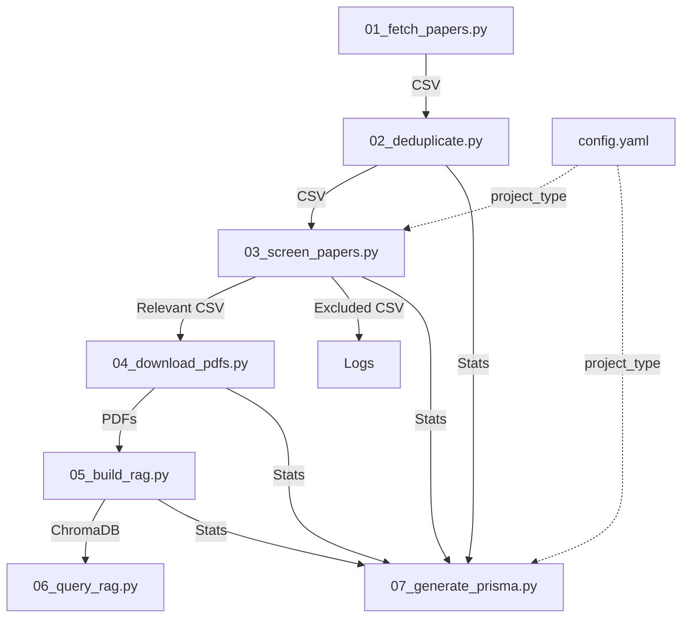
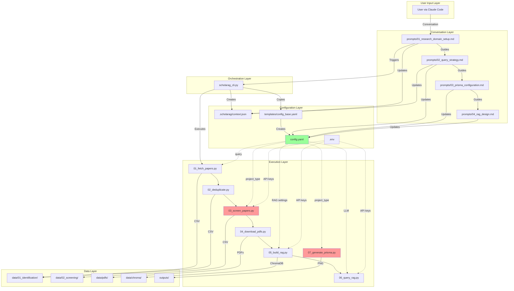

# ScholarRAG Architecture

**Version**: 1.0.12
**Last Updated**: 2025-10-19

This document explains how all files in ScholarRAG connect and communicate with each other.

---

## 📐 High-Level Architecture

```
User (via Claude Code)
    ↓
prompts/*.md (Stage 1-7 conversation flows)
    ↓
scholarag_cli.py (Orchestration & initialization)
    ↓
config.yaml (Project configuration)
    ↓
scripts/*.py (Automated pipeline execution)
    ↓
data/ (Processed results)
    ↓
outputs/ (Final RAG system + PRISMA diagram)
```

---

## 🗂️ File Organization & Data Flow

### 1. Conversation Layer (Human ↔ AI)

**Purpose**: Guide user through 7-stage workflow

| File | Stage | Reads From | Writes To | Key Decisions |
|------|-------|------------|-----------|---------------|
| `prompts/01_research_domain_setup.md` | 1 | User input | `.scholarag/context.json` | **project_type**, research_question, scope |
| `prompts/02_query_strategy.md` | 2 | Stage 1 context | `config.yaml` (query) | Query breadth (based on project_type) |
| `prompts/03_prisma_configuration.md` | 3 | Stage 1-2 context | `config.yaml` (PRISMA criteria) | Screening thresholds (based on project_type) |
| `prompts/04_rag_design.md` | 4 | Stage 1-3 context | `config.yaml` (RAG settings) | Embedding model, chunk size, LLM |
| `prompts/05_api_setup.md` | 5 | Stage 1-4 context | `.env` | API keys (Anthropic, OpenAI, etc.) |
| `prompts/06_research_conversation/*.md` | 6 | Completed RAG | Interactive queries | Research Q&A, hypothesis testing |
| `prompts/07_documentation.md` | 7 | All stages | `outputs/report.md` | PRISMA diagram, methodology doc |

**Key**:
- Prompts are **conversation scripts** for Claude Code
- They don't execute code—they **guide AI to execute scripts**
- Each prompt checks metadata to track stage progress

---

### 2. Configuration Layer (Settings & State)

**Purpose**: Store project configuration and conversation state

#### `config.yaml` (Project Configuration)
**Created by**: `scholarag_cli.py init` (Stage 1)
**Updated by**: Claude Code during Stages 2-4
**Read by**: All scripts (`01_fetch_papers.py` → `07_generate_prisma.py`)

```yaml
# Core Settings (Stage 1)
project_type: "knowledge_repository" | "systematic_review"  # ⬅️ Drives all script behavior
research_question: "..."
created_date: "2025-10-19"

# Query (Stage 2)
search_query:
  simple: "(chatbot OR agent) AND learning"

# PRISMA Criteria (Stage 3)
ai_prisma_rubric:
  decision_confidence:
    auto_include: 50   # knowledge_repository: 50, systematic_review: 90
    auto_exclude: 20   # knowledge_repository: 20, systematic_review: 10
  human_validation:
    required: false    # knowledge_repository: false, systematic_review: true

# RAG Settings (Stage 4)
rag_settings:
  embedding_model: "text-embedding-3-large"
  llm: "claude-3-5-sonnet-20241022"
```

**Dependencies**:
- `templates/config_base.yaml`: Template with inline documentation
- `.scholarag/context.json`: Conversation state (current stage, completed stages)

#### `.scholarag/context.json` (Conversation State)
**Created by**: `scholarag_cli.py init`
**Updated by**: Claude Code after each stage
**Read by**: Claude Code to resume conversations

```json
{
  "current_stage": 2,
  "completed_stages": [1],
  "project_type": "knowledge_repository",
  "research_question": "How do AI chatbots improve speaking skills?",
  "selected_databases": ["semantic_scholar", "openalex", "arxiv"],
  "query": "(chatbot OR agent) AND learning",
  "last_updated": "2025-10-19T15:30:00Z"
}
```

**Purpose**:
- Tracks which stage user is currently in
- Prevents skipping stages
- Allows resuming interrupted conversations

#### `.env` (API Keys)
**Created by**: User (Stage 5)
**Read by**: All scripts that need LLM/embedding APIs

```bash
ANTHROPIC_API_KEY=sk-ant-api03-xxxxx
OPENAI_API_KEY=sk-xxxxxxx
SEMANTIC_SCHOLAR_API_KEY=xxxxx  # Optional but recommended
```

---

### 3. Orchestration Layer (CLI Tool)

**Purpose**: Initialize projects and run pipeline stages

#### `scholarag_cli.py`
**Called by**: Claude Code or user directly
**Reads**: `config.yaml`, `.scholarag/context.json`
**Writes**: Project structure, log files
**Executes**: `scripts/*.py` in sequence

**Key Commands**:

```bash
# Initialize new project (Stage 1)
python scholarag_cli.py init

# Run specific stage (Stage 5+)
python scholarag_cli.py run-stage 5  # Fetch papers
python scholarag_cli.py run-stage 6  # Research Q&A

# Check status
python scholarag_cli.py status
```

**What it does**:
1. **init**: Creates project folder structure, copies `config_base.yaml` → `config.yaml`
2. **run-stage X**: Sequentially executes scripts for that stage
3. **status**: Checks which stages are complete (by presence of output files)

**File Dependencies**:
- Reads: `templates/config_base.yaml`
- Creates: `config.yaml`, `.scholarag/context.json`, `data/`, `outputs/`, `logs/`

---

### 4. Execution Layer (Python Scripts)

**Purpose**: Automated data processing and RAG construction



#### Script Dependencies

| Script | Reads From | Writes To | Uses config.yaml | Key Logic |
|--------|-----------|-----------|------------------|-----------|
| **01_fetch_papers.py** | `config.yaml` (query, databases) | `data/01_identification/*.csv` | Yes | Fetches from Semantic Scholar, OpenAlex, arXiv |
| **02_deduplicate.py** | `data/01_identification/*.csv` | `data/01_identification/deduplicated.csv` | No | DOI, title similarity, arXiv ID deduplication |
| **03_screen_papers.py** | `config.yaml` (project_type, PRISMA) | `data/02_screening/relevant.csv`, `excluded.csv` | **Yes** ⚠️ | **Reads project_type → sets thresholds** |
| **04_download_pdfs.py** | `data/02_screening/relevant.csv` | `data/pdfs/*.pdf` | No | Downloads from open_access URLs |
| **05_build_rag.py** | `config.yaml` (RAG settings), `data/pdfs/` | ChromaDB (`data/chroma/`) | Yes | Embedding + vector storage |
| **06_query_rag.py** | ChromaDB, `config.yaml` (LLM) | Interactive console output | Yes | RAG retrieval + LLM generation |
| **07_generate_prisma.py** | `config.yaml` (project_type), all data/ | `outputs/prisma_diagram.png` | **Yes** ⚠️ | **Reads project_type → changes title** |

**⚠️ Critical project_type Dependencies**:

#### `03_screen_papers.py`
```python
# lines 52-79
def load_config(self):
    project_type = self.config.get('project_type', 'systematic_review')

    if project_type == 'knowledge_repository':
        self.screening_threshold = 50  # Lenient
        self.exclude_threshold = 20
        self.require_human_review = False
    else:  # systematic_review
        self.screening_threshold = 90  # Strict
        self.exclude_threshold = 10
        self.require_human_review = True
```

#### `07_generate_prisma.py`
```python
# lines 165-180
project_type = self.config.get('project_type', 'systematic_review')
if project_type == 'knowledge_repository':
    title = 'Paper Processing Pipeline'
    subtitle = 'Comprehensive Knowledge Repository'
else:
    title = 'PRISMA 2020 Flow Diagram'
    subtitle = 'Systematic Literature Review'
```

---

### 5. Data Layer (Processing Stages)

**Purpose**: Store intermediate and final results

```
projects/<project_name>/
├── config.yaml                          # ⬅️ Configuration hub
├── .scholarag/
│   └── context.json                     # ⬅️ Conversation state
├── data/
│   ├── 01_identification/               # Stage 1: Fetch
│   │   ├── semantic_scholar_results.csv
│   │   ├── openalex_results.csv
│   │   ├── arxiv_results.csv
│   │   └── deduplicated.csv             # ⬅️ Input to screening
│   ├── 02_screening/                    # Stage 2: PRISMA
│   │   ├── relevant_papers.csv          # ⬅️ Input to PDF download
│   │   └── excluded_papers.csv
│   ├── pdfs/                            # Stage 3: Download
│   │   └── *.pdf                        # ⬅️ Input to RAG
│   └── chroma/                          # Stage 4: RAG Build
│       └── [ChromaDB files]             # ⬅️ Vector database
└── outputs/
    ├── prisma_diagram.png               # Stage 5: Visualization
    └── report.md                        # Stage 6: Documentation
```

**Data Flow**:
1. `01_fetch_papers.py` → `data/01_identification/*.csv`
2. `02_deduplicate.py` → `data/01_identification/deduplicated.csv`
3. `03_screen_papers.py` → `data/02_screening/relevant.csv` (used by 04)
4. `04_download_pdfs.py` → `data/pdfs/*.pdf` (used by 05)
5. `05_build_rag.py` → `data/chroma/` (used by 06)
6. `06_query_rag.py` → Interactive (reads from `data/chroma/`)
7. `07_generate_prisma.py` → `outputs/prisma_diagram.png`

---

## 🔄 Complete Workflow: How Files Connect

### Stage 1: Research Domain Setup

```
User → prompts/01_research_domain_setup.md
  ↓ (Claude Code reads metadata)
  ↓ Conversation: Choose project_type, define research question
  ↓
scholarag_cli.py init
  ↓ Creates config.yaml from templates/config_base.yaml
  ↓ Sets project_type: "knowledge_repository" or "systematic_review"
  ↓
.scholarag/context.json created
  ↓ Records: current_stage=1, project_type, research_question
```

### Stage 2: Query Strategy Design

```
User → prompts/02_query_strategy.md
  ↓ (Claude reads project_type from context.json)
  ↓ If knowledge_repository → Recommends "Comprehensive" query
  ↓ If systematic_review → Recommends "Balanced" query
  ↓ Conversation: Design Boolean query
  ↓
Claude Code updates config.yaml
  ↓ search_query.simple: "(chatbot OR agent) AND learning"
  ↓
.scholarag/context.json updated
  ↓ current_stage=2, query saved
```

### Stage 3: PRISMA Configuration

```
User → prompts/03_prisma_configuration.md
  ↓ (Claude reads project_type from config.yaml)
  ↓ If knowledge_repository → Minimal filtering prompts
  ↓ If systematic_review → Detailed PRISMA criteria prompts
  ↓ Conversation: Set thresholds
  ↓
Claude Code updates config.yaml
  ↓ ai_prisma_rubric.decision_confidence.auto_include: 50 or 90
  ↓ ai_prisma_rubric.human_validation.required: false or true
```

### Stage 5: Automated Execution

```
scholarag_cli.py run-stage 5
  ↓
01_fetch_papers.py
  ↓ Reads: config.yaml (search_query, databases)
  ↓ Writes: data/01_identification/*.csv
  ↓
02_deduplicate.py
  ↓ Reads: data/01_identification/*.csv
  ↓ Writes: data/01_identification/deduplicated.csv
  ↓
03_screen_papers.py ⚠️
  ↓ Reads: config.yaml (project_type) ← KEY BRANCHING POINT
  ↓ IF project_type == "knowledge_repository":
  │   → auto_include: 50, auto_exclude: 20
  │   → No human review
  │   → Expected retention: 80-90%
  ↓ IF project_type == "systematic_review":
  │   → auto_include: 90, auto_exclude: 10
  │   → Human review prompt
  │   → Expected retention: 2-10%
  ↓ Writes: data/02_screening/relevant.csv
  ↓
04_download_pdfs.py → data/pdfs/
  ↓
05_build_rag.py → data/chroma/
  ↓
07_generate_prisma.py ⚠️
  ↓ Reads: config.yaml (project_type) ← KEY BRANCHING POINT
  ↓ IF project_type == "knowledge_repository":
  │   → Title: "Paper Processing Pipeline"
  ↓ IF project_type == "systematic_review":
  │   → Title: "PRISMA 2020 Flow Diagram"
  ↓ Writes: outputs/prisma_diagram.png
```

---

## 🧩 File Dependency Map (Visual)



**Legend**:
- 🟢 Green: `config.yaml` - Configuration hub
- 🔴 Red: Scripts with `project_type` branching logic
- → Solid arrows: Direct execution/creation
- ⋯> Dotted arrows: Reads configuration

---

## 🚨 Critical Files That Must Stay Synchronized

### 1. Project Type Logic

**If you change `project_type` behavior**, update these files:

| File | What to Update | Why |
|------|----------------|-----|
| `prompts/01_research_domain_setup.md` | Metadata `outputs.project_type` | Defines allowed values |
| `prompts/02_query_strategy.md` | Query recommendations table | User guidance |
| `prompts/03_prisma_configuration.md` | PRISMA workflow instructions | User guidance |
| `templates/config_base.yaml` | Default `project_type` value + comments | Template |
| `scripts/03_screen_papers.py` | `load_config()` threshold logic | Automation |
| `scripts/07_generate_prisma.py` | `create_prisma_diagram()` title logic | Visualization |
| `scholarag_cli.py` | Validation logic (if added) | CLI |

### 2. Configuration Schema

**If you add new fields to `config.yaml`**, update:

| File | What to Update |
|------|----------------|
| `templates/config_base.yaml` | Add field with inline documentation |
| Relevant `prompts/*.md` | Update conversation to collect this field |
| Relevant `scripts/*.py` | Read and use the new field |
| `ARCHITECTURE.md` (this file) | Document the new field's purpose and dependencies |

---

## 🛠️ How to Find Missing Dependencies

### Method 1: Search for config.yaml Reads

```bash
# Find all scripts that read config.yaml
grep -r "config.yaml" scripts/
grep -r "self.config.get" scripts/
grep -r "yaml.safe_load" scripts/
```

### Method 2: Search for project_type Usage

```bash
# Find all files that use project_type
grep -r "project_type" .
grep -r "knowledge_repository" .
grep -r "systematic_review" .
```

### Method 3: Check Script Imports

```bash
# Find all scripts that import yaml (config readers)
grep -r "import yaml" scripts/
```

**Current files that read `config.yaml`**:
1. ✅ `scripts/01_fetch_papers.py` - Reads query, databases
2. ✅ `scripts/03_screen_papers.py` - Reads project_type, PRISMA thresholds
3. ✅ `scripts/05_build_rag.py` - Reads RAG settings (embedding, LLM)
4. ✅ `scripts/06_query_rag.py` - Reads LLM settings
5. ✅ `scripts/07_generate_prisma.py` - Reads project_type, project_name

**Files that DON'T read config but probably should** (Future enhancement):
- `scripts/02_deduplicate.py` - Could read deduplication strategy from config
- `scripts/04_download_pdfs.py` - Could read PDF download preferences

---

## 📊 Data Format Specifications

### CSV Schemas

#### `data/01_identification/semantic_scholar_results.csv`
```
title, abstract, authors, year, doi, arxiv_id, url, pdf_url, source
```

#### `data/02_screening/relevant_papers.csv`
```
title, abstract, authors, year, doi, pdf_url, relevance_score, ai_reasoning
```

### YAML Schema: config.yaml

```yaml
# Required fields (Stage 1)
project_name: str
project_type: "knowledge_repository" | "systematic_review"
research_question: str

# Required fields (Stage 2)
search_query:
  simple: str

# Required fields (Stage 3)
ai_prisma_rubric:
  decision_confidence:
    auto_include: int (0-100)
    auto_exclude: int (0-100)
  human_validation:
    required: bool

# Required fields (Stage 4)
rag_settings:
  embedding_model: str
  llm: str
```

### JSON Schema: .scholarag/context.json

```json
{
  "current_stage": int (1-7),
  "completed_stages": [int],
  "project_type": "knowledge_repository" | "systematic_review",
  "research_question": str,
  "query": str,
  "last_updated": ISO8601 timestamp
}
```

---

## 🔍 Debugging Checklist

When something doesn't work, check these files in order:

1. **`.scholarag/context.json`** - Is current_stage correct?
2. **`config.yaml`** - Does it have all required fields? Is `project_type` set?
3. **`.env`** - Are API keys present?
4. **`data/` folders** - Do previous stages' outputs exist?
5. **`logs/` files** - Are there error messages?

---

## 🎯 Quick Reference: "Where is X defined?"

| What | Where Defined | Where Used |
|------|---------------|------------|
| **project_type** | `config.yaml` (Stage 1) | `03_screen_papers.py`, `07_generate_prisma.py`, all prompts |
| **research_question** | `config.yaml` (Stage 1) | `03_screen_papers.py` (for AI prompt) |
| **search_query** | `config.yaml` (Stage 2) | `01_fetch_papers.py` |
| **PRISMA thresholds** | `config.yaml` (Stage 3) | `03_screen_papers.py` |
| **RAG settings** | `config.yaml` (Stage 4) | `05_build_rag.py`, `06_query_rag.py` |
| **API keys** | `.env` (Stage 5) | `03_screen_papers.py`, `05_build_rag.py`, `06_query_rag.py` |
| **Conversation state** | `.scholarag/context.json` | Claude Code (to resume conversations) |

---

## 📌 Summary

**Key Takeaway**: `config.yaml` is the **central hub** that all scripts read from. The `project_type` field in `config.yaml` drives behavior in:

1. **`03_screen_papers.py`** → Adjusts screening thresholds
2. **`07_generate_prisma.py`** → Changes diagram title
3. **All prompts** → Guides conversation differently

**To add a new feature**:
1. Update `templates/config_base.yaml` (add field)
2. Update relevant `prompts/*.md` (collect user input)
3. Update relevant `scripts/*.py` (read and use field)
4. Update this `ARCHITECTURE.md` (document dependencies)
5. Update `RELEASE_NOTES_vX.X.X.md` (describe change)

---

**Questions?** Check the [GitHub Issues](https://github.com/HosungYou/researcherRAG/issues) or create a new discussion.
