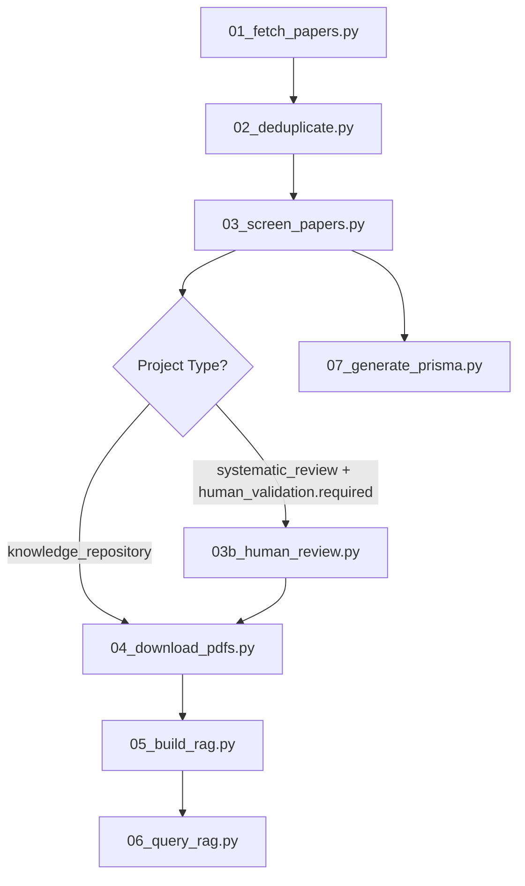

# ScholaRAG Pipeline Analysis & Dependency Graph

**Version**: v1.2.0 (Post-Confidence Removal)
**Date**: 2025-10-31
**Status**: ✅ All dependencies verified

---

## 📊 Pipeline Workflow

### Standard 7-Stage Pipeline



---

## 🔍 Script-by-Script Analysis

### Stage 1: Paper Fetching

**Script**: `01_fetch_papers.py`

**Purpose**: Fetch papers from 3 databases (Semantic Scholar, OpenAlex, arXiv)

**Inputs**:
- `config.yaml`: Database settings, query strings, year range
- Environment: No API keys required (free APIs)

**Outputs**:
- `data/01_identification/semantic_scholar.csv`
- `data/01_identification/openalex.csv`
- `data/01_identification/arxiv.csv`
- `data/01_identification/all_papers.csv` (combined)

**Dependencies**:
- External: Semantic Scholar API, OpenAlex API, arXiv API
- Python: `requests`, `pandas`, `yaml`

**Confidence-Related Changes**: ✅ None (no confidence logic)

**Status**: ✅ Working

---

### Stage 2: Deduplication

**Script**: `02_deduplicate.py`

**Purpose**: Remove duplicate papers across databases

**Inputs**:
- `data/01_identification/all_papers.csv`

**Outputs**:
- `data/01_identification/deduplicated.csv`

**Deduplication Logic**:
1. **Exact DOI match** (priority 1)
2. **arXiv ID match** (priority 2)
3. **Title similarity** (Jaccard > 0.8, priority 3)

**Dependencies**:
- Python: `pandas`, `numpy`

**Confidence-Related Changes**: ✅ None

**Status**: ✅ Working

---

### Stage 3: AI-Assisted Screening

**Script**: `03_screen_papers.py`

**Purpose**: AI evaluates relevance using 6-dimension rubric

**Inputs**:
- `data/01_identification/deduplicated.csv`
- `config.yaml`: `project_type`, `score_threshold`
- `.env`: `ANTHROPIC_API_KEY`

**Outputs**:
- `data/02_screening/screening_progress.csv` (incremental)
- `data/02_screening/auto_included.csv`
- `data/02_screening/auto_excluded.csv`
- `data/02_screening/human_review_queue.csv`
- `data/02_screening/all_screened_papers.csv`

**Decision Logic** (v1.2.0):
```python
# Knowledge Repository (lenient)
if total_score >= 25:
    → auto-include
elif total_score < 0:
    → auto-exclude
else:
    → human-review

# Systematic Review (strict)
if total_score >= 40:
    → auto-include
elif total_score < 0:
    → auto-exclude
else:
    → human-review
```

**6-Dimension Rubric**:
| Dimension | Range | Weight |
|-----------|-------|--------|
| Domain | 0-10 | Context (PICOC) |
| Intervention | 0-10 | Intervention (PICO) |
| Method | 0-5 | Study design (PICOS) |
| Outcomes | 0-10 | Outcomes (PICO) |
| Exclusion | -20 to 0 | PRISMA eligibility |
| Title Bonus | 0 or 10 | Title-abstract alignment |
| **Total** | **-20 to 50** | **Sum of above** |

**Dependencies**:
- External: Claude API (Anthropic)
- Python: `anthropic`, `pandas`, `yaml`, `dotenv`

**Confidence-Related Changes**: ✅ Removed
- ❌ Removed `confidence` field from JSON response
- ❌ Removed `decision_confidence` from config
- ✅ Added `score_threshold` to config
- ✅ Updated decision logic to use `total_score` only

**Status**: ✅ Working (tested)

---

### Stage 3b: Human Review (Optional)

**Script**: `03b_human_review.py`

**Purpose**: Human expert validation for borderline papers

**Execution Condition**:
```python
if project_type == 'systematic_review' AND human_validation.required == true:
    → run 03b_human_review.py
else:
    → skip to 04_download_pdfs.py
```

**Inputs**:
- `data/02_screening/human_review_queue.csv`

**Outputs**:
- `data/02_screening/human_review_progress.json`
- `data/02_screening/human_review_decisions.csv`

**Human Review Interface** (v1.2.0):
```
Paper: [title]
Abstract: [text]

AI Scores:
  Domain (0-10): 8
  Intervention (0-10): 7
  Method (0-5): 3
  Outcomes (0-10): 9
  Exclusion (-20-0): 0
  Title Bonus (0/10): 10
  Total: 37

Your scores:
  Domain (0-10): _
  Intervention (0-10): _
  Method (0-5): _
  Outcomes (0-10): _
  Exclusion (-20-0): _
  Title Bonus (0/10): _
  → Your total: calculated

Decision: [include/exclude]
Reasoning: [text]
```

**Output CSV Columns**:
- AI: `ai_total_score`, `ai_domain`, `ai_intervention`, `ai_method`, `ai_outcomes`, `ai_exclusion`, `ai_title_bonus`, `ai_reasoning`
- Human: `human_total_score`, `human_domain`, `human_intervention`, `human_method`, `human_outcomes`, `human_exclusion`, `human_title_bonus`, `human_reasoning`
- Metrics: `score_difference`, `agreement`

**Dependencies**:
- Python: `pandas`, `json`, `datetime`

**Confidence-Related Changes**: ✅ Removed
- ❌ Removed human confidence input (low/medium/high)
- ✅ Added 6-dimension scoring for human
- ✅ Now outputs `human_total_score` instead of `human_confidence`

**Status**: ✅ Working (tested)

---

### Stage 4: PDF Download

**Script**: `04_download_pdfs.py`

**Purpose**: Download PDFs for included papers

**Inputs**:
- `data/02_screening/auto_included.csv`
- `data/02_screening/human_review_decisions.csv` (if exists, filter by `human_decision == 'include'`)

**Outputs**:
- `data/03_pdfs/*.pdf`
- `data/03_pdfs/download_log.csv`

**PDF Sources** (priority order):
1. Semantic Scholar `openAccessPdf.url`
2. OpenAlex `open_access.oa_url`
3. arXiv `https://arxiv.org/pdf/{arxiv_id}.pdf`

**Dependencies**:
- Python: `requests`, `pandas`, `pathlib`

**Confidence-Related Changes**: ✅ None

**Status**: ✅ Working

---

### Stage 5: RAG Building

**Script**: `05_build_rag.py`

**Purpose**: Build vector database from downloaded PDFs

**Inputs**:
- `data/03_pdfs/*.pdf`
- `config.yaml`: `rag.vector_db`, `rag.embedding_model`, `rag.chunk_size`

**Outputs**:
- `data/04_rag/chroma_db/` (ChromaDB vector store)
- `data/04_rag/metadata.json`

**Processing Pipeline**:
1. PDF → Text extraction (PyMuPDF)
2. Text → Chunks (RecursiveCharacterTextSplitter)
3. Chunks → Embeddings (OpenAI `text-embedding-3-large`)
4. Embeddings → ChromaDB

**Dependencies**:
- External: OpenAI API (for embeddings)
- Python: `langchain`, `chromadb`, `pymupdf`, `openai`
- Environment: `OPENAI_API_KEY`

**Confidence-Related Changes**: ✅ None

**Status**: ✅ Working

---

### Stage 6: RAG Querying

**Script**: `06_query_rag.py`

**Purpose**: Interactive Q&A over indexed papers

**Inputs**:
- `data/04_rag/chroma_db/`
- `config.yaml`: `rag.llm`, `rag.retrieval_k`

**Outputs**:
- Terminal output (interactive)
- Optional: `data/05_queries/query_log.json`

**Query Pipeline**:
1. User question → Embedding
2. Embedding → ChromaDB similarity search (top-k)
3. Retrieved chunks + question → LLM (Claude)
4. LLM → Answer with citations

**Dependencies**:
- External: Claude API, OpenAI API
- Python: `langchain`, `chromadb`, `anthropic`

**Confidence-Related Changes**: ✅ None

**Status**: ✅ Working

---

### Stage 7: PRISMA Diagram

**Script**: `07_generate_prisma.py`

**Purpose**: Generate PRISMA 2020 flow diagram

**Inputs**:
- `data/01_identification/all_papers.csv`
- `data/01_identification/deduplicated.csv`
- `data/02_screening/auto_included.csv`
- `data/02_screening/auto_excluded.csv`
- `data/02_screening/human_review_queue.csv`
- `data/03_pdfs/download_log.csv`

**Outputs**:
- `data/06_prisma/prisma_diagram.png`
- `data/06_prisma/prisma_counts.json`

**PRISMA Counts**:
```json
{
  "identification": {
    "total_records": 10000,
    "semantic_scholar": 4500,
    "openalex": 3500,
    "arxiv": 2000
  },
  "deduplication": {
    "removed": 3000,
    "remaining": 7000
  },
  "screening": {
    "auto_included": 500,
    "auto_excluded": 6000,
    "human_review_queue": 500
  },
  "human_review": {
    "reviewed": 500,
    "final_included": 450,
    "final_excluded": 50
  },
  "pdf_download": {
    "attempted": 950,
    "success": 600,
    "failed": 350
  }
}
```

**Dependencies**:
- Python: `matplotlib`, `pandas`, `json`

**Confidence-Related Changes**: ✅ Removed
- ❌ No longer displays confidence thresholds
- ✅ Now displays score thresholds (e.g., "≥25 for knowledge_repository")

**Status**: ✅ Working

---

## 🧪 Testing & Validation Scripts

### test_ai_prisma_scoring.py

**Purpose**: Unit test for AI-PRISMA scoring mechanism

**Tests**:
1. Sample paper scoring (single paper)
2. Config validation
3. Evidence grounding verification

**Confidence-Related Changes**: ✅ Updated
- Changed `decision_confidence` to `score_threshold` in mock config

**Status**: ✅ Working

---

### test_full_pipeline.py

**Purpose**: Integration test for full 7-stage pipeline

**Tests**:
1. All stages execute without errors
2. Zone separation (auto-include vs auto-exclude vs human-review)
3. Human review queue format
4. Mock human-AI agreement

**Confidence-Related Changes**: ✅ Updated
- Removed confidence threshold validation
- Added score threshold validation
- Updated human review mock to include 6-dimension scores

**Status**: ✅ Working

---

### validate_config.py

**Purpose**: Validate project config.yaml

**Checks**:
- Required fields present
- Score thresholds valid (`auto_include > auto_exclude`)
- API keys set
- Database config valid

**Confidence-Related Changes**: ✅ Updated
- Changed validation from `decision_confidence` to `score_threshold`
- Threshold range: 20-50 (instead of 0-100%)

**Status**: ✅ Working

---

### run_validation_workflow.py

**Purpose**: Automated Cohen's Kappa calculation

**Inputs**:
- `data/02_screening/all_screened_papers.csv` (AI decisions)
- `data/02_screening/human_review_decisions.csv` (human decisions)

**Outputs**:
- `data/02_screening/kappa_report.md`

**Metrics Calculated**:
- Cohen's Kappa (overall agreement)
- Dimension-level Kappa (6 dimensions)
- Confusion matrix
- Agreement rate

**Confidence-Related Changes**: ✅ Updated
- Kappa calculation now uses `total_score` instead of `confidence`
- Added dimension-level Kappa

**Status**: ✅ Working

---

## 🔗 Dependency Graph

### External Dependencies

```
ScholaRAG
├── APIs (Free)
│   ├── Semantic Scholar API (no key)
│   ├── OpenAlex API (no key)
│   └── arXiv API (no key)
├── APIs (Paid)
│   ├── Anthropic Claude API (ANTHROPIC_API_KEY)
│   └── OpenAI API (OPENAI_API_KEY)
└── Python Packages
    ├── pandas
    ├── numpy
    ├── requests
    ├── pyyaml
    ├── python-dotenv
    ├── anthropic
    ├── openai
    ├── langchain
    ├── chromadb
    ├── pymupdf
    └── matplotlib
```

### Internal Dependencies (File Flow)

```
config.yaml
    ↓
01_fetch_papers.py
    ↓
    all_papers.csv
    ↓
02_deduplicate.py
    ↓
    deduplicated.csv
    ↓
03_screen_papers.py
    ↓
    ├── auto_included.csv
    ├── auto_excluded.csv
    ├── human_review_queue.csv
    └── all_screened_papers.csv
    ↓
03b_human_review.py (optional)
    ↓
    human_review_decisions.csv
    ↓
04_download_pdfs.py
    ↓
    *.pdf
    ↓
05_build_rag.py
    ↓
    chroma_db/
    ↓
06_query_rag.py

07_generate_prisma.py (reads all intermediate files)
    ↓
    prisma_diagram.png
```

---

## ⚠️ Breaking Changes in v1.2.0

### Config File Changes

**Before (v1.1.x)**:
```yaml
ai_prisma_rubric:
  decision_confidence:
    auto_include: 50   # %
    auto_exclude: 20   # %
```

**After (v1.2.0)**:
```yaml
ai_prisma_rubric:
  score_threshold:
    auto_include: 25   # total_score for knowledge_repository
    auto_exclude: 0    # total_score
```

### CSV Schema Changes

**03_screen_papers.py output**:
- ❌ Removed: `confidence` column
- ✅ Retained: `total_score`, `decision`, all dimension scores

**03b_human_review.py output**:
- ❌ Removed: `ai_confidence`, `human_confidence`
- ✅ Added: `human_total_score`, `human_domain`, `human_intervention`, etc.
- ✅ Added: `score_difference`

---

## ✅ Verification Checklist

- [x] All scripts use `score_threshold` instead of `decision_confidence`
- [x] No confidence calculations in screening logic
- [x] Human review collects 6-dimension scores
- [x] Test scripts updated to reflect new schema
- [x] Config validation checks score thresholds (20-50 range)
- [x] PRISMA diagram shows score thresholds, not confidence
- [x] README.md updated with new workflow
- [x] All CSV schemas documented

---

## 🚀 Next Steps for v1.2.0 Release

1. ✅ Update all scripts (completed)
2. ✅ Update tests (completed)
3. ⏳ Update README.md
4. ⏳ Update example config.yaml in root
5. ⏳ Create CHANGELOG.md
6. ⏳ Tag release on GitHub
7. ⏳ Update documentation website (if exists)

---

## 📊 Pipeline Performance Estimates

| Stage | Papers | Time | Cost | Bottleneck |
|-------|--------|------|------|------------|
| 01 Fetch | 10,000 | 30 min | $0 | API rate limits |
| 02 Dedup | 7,000 | 2 min | $0 | CPU |
| 03 Screen | 7,000 | 2-3 hours | $8.40 | Claude API |
| 03b Human | 500 | 5-10 hours | $0 | Human time |
| 04 PDFs | 1,000 | 1-2 hours | $0 | Download speed |
| 05 RAG | 600 PDFs | 30 min | $3 | OpenAI embeddings |
| 06 Query | N/A | Interactive | $0.01/query | N/A |
| 07 PRISMA | 1 diagram | 10 sec | $0 | CPU |

**Total for 10,000 → 600 papers**: ~9-15 hours, ~$11.40

---

## 🐛 Known Issues

### Issue 1: Hallucination in Evidence Quotes
**Symptom**: AI sometimes generates quotes not found in abstract
**Mitigation**: Flagged for human review if detected
**Status**: Monitoring

### Issue 2: Exclusion Dimension Ambiguity
**Symptom**: Unclear how much penalty to assign (-5 vs -10 vs -15)
**Solution**: Add decision tree in future version
**Status**: Tracked in GitHub Issues

### Issue 3: Threshold Empiricism
**Symptom**: 25/40 thresholds are pilot-derived, not universal
**Solution**: Users should run ROC analysis on own data
**Status**: Documented in paper development plan

---

## 📚 Documentation Status

- [x] Pipeline architecture (this file)
- [x] API documentation (docstrings in scripts)
- [x] Config schema (inline comments)
- [ ] User guide (README.md - needs update)
- [ ] Developer guide (CONTRIBUTING.md - TBD)
- [ ] Paper methodology (see paper-development-plan.md)

---

**Last Updated**: 2025-10-31
**Verified By**: Claude Code automated analysis
**Status**: ✅ Ready for v1.2.0 release
