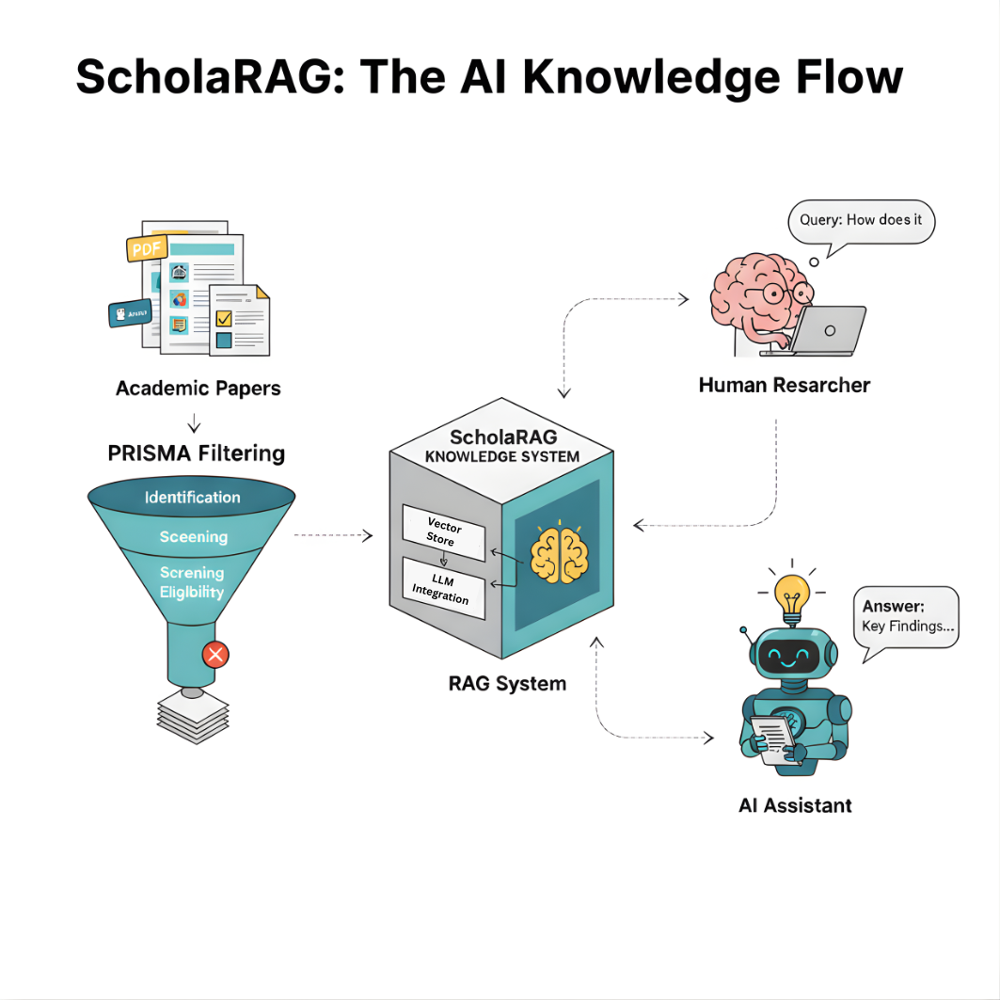

# ScholaRAG



**AI-Powered Systematic Literature Review Automation**

Transform weeks of manual literature review into hours of automated, reproducible research.

[](https://opensource.org/licenses/MIT)
[](https://www.python.org/downloads/)
[](https://researcher-rag-helper.vercel.app/)

---

## 🎯 What is ScholaRAG?

ScholaRAG is an **open-source framework** that helps researchers build custom RAG (Retrieval-Augmented Generation) systems for literature review and research through **conversational AI guidance** in VS Code.

### Two Modes for Different Research Needs

ScholaRAG supports **two project types** to serve different research goals:

#### 📊 Knowledge Repository Mode 🗂️
**For comprehensive domain coverage**

In **30 minutes of active setup** + **2-4 hours of automated processing**, you'll create:

- ✅ **Comprehensive Collection**: Broad queries fetch 20,000-30,000 papers
- ✅ **Minimal Filtering**: AI removes only spam/duplicates (80-90% retention)
- ✅ **Large Vector Database**: 15,000-20,000 papers for semantic search
- ✅ **Interactive Q&A**: Explore entire domain, discover connections

**Use for**: Domain mapping, teaching materials, exploratory research, AI research assistants

#### 📄 Systematic Review Mode 📄
**For publication-quality systematic reviews**

In **30 minutes of active setup** + **3-5 hours of automated processing**, you'll create:

- ✅ **PRISMA 2020-Compliant Pipeline**: Screen 1,000-5,000 papers → 50-300 final papers
- ✅ **Strict Filtering**: Detailed inclusion/exclusion criteria (2-10% retention)
- ✅ **Focused Vector Database**: High-quality papers for deep analysis
- ✅ **Research RAG System**: Query with citations, methods, effect sizes

**Use for**: Meta-analysis, systematic review publications, clinical guidelines, dissertations

### Why ScholaRAG?

**Traditional Systematic Review** (6-8 weeks):
- 📚 Manual database searches (PubMed, ERIC, Web of Science)
- 📊 Export 20,000+ papers to Excel, read abstracts one by one
- 📄 Review hundreds of PDFs for inclusion criteria
- ✍️ Extract findings, constantly re-read papers for citations

**With ScholaRAG** (2-3 weeks):
- 🤖 **30-minute setup**: Build RAG system with AI assistant step-by-step
- ⚡ **2-hour screening**: AI-powered PRISMA (20,000 papers → PRISMA-filtered relevant set)
- 💬 **Instant queries**: "What are the main effects?" → Evidence + citations
- 💰 **Fixed $20/month**: Claude Pro subscription (Haiku 4.5 sufficient for individual researchers)

**Result**: **67-75% time savings**, never forget a relevant paper again.

---

## 🚀 Quick Start

### Prerequisites

- **VS Code** installed
- **AI Coding Assistant**: Choose one:
  - **Claude Code** (recommended) - $20/month Claude Pro
  - **GPT-5-Codex** - OpenAI subscription
- **Python 3.9+** (your AI assistant will handle installation)

### Conversation-First Setup (Recommended)

**You don't need to run commands yourself.** Simply talk to your AI assistant in VS Code:

#### Step 1: Install AI Assistant Extension in VS Code

**Option A: Claude Code (Recommended)**

1. Open VS Code
2. Press Cmd+Shift+X (Mac) or Ctrl+Shift+X (Windows/Linux) to open Extensions
3. Search for "Claude Code"
4. Click "Install"
5. Sign in with your Anthropic account (Claude Pro required)

Alternative: Install via Terminal
```bash
npm install -g @anthropic/claude-code
claude-code
```
See: https://www.claude.com/product/claude-code

**Option B: GPT-5-Codex**

1. Open VS Code
2. Press Cmd+Shift+X (Mac) or Ctrl+Shift+X (Windows/Linux) to open Extensions
3. Search for "GitHub Copilot" (provides Codex access)
4. Click "Install"
5. Sign in with OpenAI account (subscription required)

#### Step 2: Open AI Chat

Once extension is installed, click the AI assistant icon in VS Code sidebar:
- **Claude Code**: Click the Claude icon in the Activity Bar (left sidebar)
- **GPT-5-Codex**: Click the Copilot Chat icon in the Activity Bar (left sidebar)

Or use keyboard shortcuts:
- **Claude Code**: Press Cmd+Shift+P (Mac) or Ctrl+Shift+P (Windows/Linux), then type "Claude: Open Chat"
- **GPT-5-Codex**: Press Cmd+Shift+P (Mac) or Ctrl+Shift+P (Windows/Linux), then type "GitHub Copilot: Open Chat"

#### Step 3: Copy-Paste This Prompt

```
Please set up ScholaRAG for me:

1. Clone https://github.com/HosungYou/ScholaRAG.git
2. Navigate into ScholaRAG directory
3. Create Python virtual environment (venv)
4. Activate the virtual environment
5. Install CLI dependencies: pip install click pyyaml
6. Initialize my first project: python scholarag_cli.py init
7. Guide me through Stage 1 of the systematic review workflow

My research topic: [Describe your research question here]
```

#### Step 4: Follow the Conversation

Your AI assistant will:
- Execute all setup commands automatically
- Create your project folder structure
- Guide you through 7 stages conversationally
- Track progress via .scholarag/context.json
- Run scripts when needed (you never touch terminal)

**That's it!** Just keep chatting to complete your systematic review.

---

### Alternative: Manual CLI Mode

For users who prefer direct command-line control:

```bash
# Clone the repository
git clone https://github.com/HosungYou/ScholaRAG.git
cd ScholaRAG

# Create virtual environment
python3 -m venv venv

# Activate virtual environment
# On macOS/Linux:
source venv/bin/activate
# On Windows:
venv\Scripts\activate

# Install CLI dependencies
pip install --upgrade pip
pip install click pyyaml

# Initialize your first project
python scholarag_cli.py init

# Check progress
python scholarag_cli.py status

# Get next step guidance
python scholarag_cli.py next
```

**Note**: Manual mode requires you to run Stage scripts yourself. Conversation mode is recommended for seamless automation.

---

## 🆕 Template-Free AI-PRISMA v2.0 (v1.1.4+)

ScholaRAG v1.1.4 eliminates manual domain templates. Claude now **interprets your research question directly** using **PICOC+S-derived relevance scoring with automation-aware prioritisation**, making the system instantly applicable to **any research domain** without configuration overhead.

**🎓 Academic Positioning (v1.1.6):** ScholaRAG synthesizes **PICOC** (context-sensitive population, Booth et al., 2012) and **PICOS** (study design rigor, Higgins et al., 2022) with automation research insights (O'Mara-Eves et al., 2015). See [RELEASE_NOTES_v1.1.6.md](RELEASE_NOTES_v1.1.6.md) for complete academic lineage with 13 scholarly citations.

### What Changed from v1.1.3

| Feature | v1.1.3 (Old) | v1.1.4 (New) |
|---------|-------------|-------------|
| **Setup time** | 30-60 minutes (manual keyword config) | 0 minutes (automatic interpretation) |
| **Domain templates** | Required (`--domain education`) | ❌ Removed |
| **Keyword lists** | Manual (`domain_keywords`, `method_keywords`) | ✅ Auto-inferred from research question |
| **PRISMA config** | 20-30 min interactive configuration | 5-10 min validation |
| **Supports** | Education, Medicine, Social Science templates only | **Any research domain** |

### How It Works

**Step 1: Initialize** (no domain needed)
```bash
python scholarag_cli.py init \
  --name "AI-Chatbots-Language-Learning" \
  --question "How do AI chatbots improve speaking proficiency in EFL learners?" \
  --project-type systematic_review
```

**Step 2: Claude interprets using PICOC+S-derived rubric**
- **Domain** (PICOC: Context): Research field + participant context, context-sensitive population definition (Booth et al., 2012) ✅
- **Intervention** (PICO: same): AI chatbots (Richardson et al., 1995) ✅
- **Method** (PICOS: Study design): Study design rigor prioritization (Higgins et al., 2022; Cochrane Handbook) ✅
- **Outcomes** (PICO: same): Speaking proficiency metrics (Richardson et al., 1995) ✅
- **Exclusion** (PRISMA 2020): PRISMA-derived hard filters for eligibility (Page et al., 2021) ✅
- **Title Bonus** (Automation research): Title-abstract alignment signal from text-mining automation (O'Mara-Eves et al., 2015) ✅

**Academic lineage:** Every dimension maps to established frameworks or automation research. See [Complete Academic Lineage](RELEASE_NOTES_v1.1.6.md#-academic-lineage-of-scholorags-6-dimension-rubric)

**Step 3: Automatic threshold configuration**
- `systematic_review`: 90/10 thresholds + human validation
- `knowledge_repository`: 50/20 thresholds + AI-only

**Step 4: Evidence-grounded scoring**
Every score includes direct quotes from the abstract (no hallucinations).

### Example: Template-Free Config

```yaml
ai_prisma_rubric:
  enabled: true
  decision_confidence:
    auto_include: 90  # Based on project_type
    auto_exclude: 10
  notes: |
    Population: University or adult L2 learners (18+).
    Intervention: AI-enabled conversational agents (ChatGPT, GPT-4, LLMs).
    Outcomes: Speaking proficiency (fluency, pronunciation, oral exams).
    Exclude: K-12 only studies, rule-based bots, purely theoretical papers.
  guidance:
    domain_signals:
      - "Higher education or adult ESL/EFL learners"
    intervention_signals:
      - "AI chatbot, conversational agent, LLM tutor"
    outcomes_signals:
      - "Measured speaking improvements"
    exclusion_signals:
      - "Editorial/opinion only"
      - "Non-AI rule-based bot"
```

No `templates/` directory needed—`config.yaml` is the single source of truth.

### Migration from v1.1.3

If upgrading from v1.1.3:
1. ❌ Remove `--domain` parameter from CLI commands
2. ❌ Delete `templates/research_profiles/` references in config
3. ✅ Use template-free `ai_prisma_rubric` structure (see above)
4. ✅ Claude will guide rubric calibration in Stage 3

---

## 🖥️ Query Interfaces

ScholaRAG provides **three interfaces** for querying your RAG system after pipeline completion. Choose based on your workflow preference.

### Option 1: Claude Code CLI (Default)

**Best for**: Conversational research, exploratory analysis

```bash
# Interactive conversation with Claude Code
# Copy Stage 6 prompt from website, paste to Claude Code
# Natural language queries with full context awareness
```

**Pros**: Context-aware follow-ups, handles complex multi-part questions, automatic citation formatting
**Cons**: Requires Claude Code environment

### Option 2: Streamlit Web UI

**Best for**: Non-technical users, presentation/demos

```bash
cd interfaces/streamlit_app
pip install -r requirements.txt
streamlit run app.py
```

**Features**:
- 🌐 Browser-based interface (no CLI required)
- 📊 Visual result cards with relevance scores
- 💾 Export results to CSV/JSON
- 🔍 Filter by paper, date range, relevance threshold

**Pros**: Intuitive GUI, shareable with colleagues, no coding needed
**Cons**: Less sophisticated than conversational mode

### Option 3: FastAPI Server

**Best for**: Integrations, batch processing, custom applications

```bash
cd interfaces/fastapi_server
pip install -r requirements.txt
uvicorn main:app --reload
```

**API Endpoints**:
```python
# Query RAG system
POST /query
Body: {"query": "What are main findings?", "top_k": 5}

# Get paper metadata
GET /papers/{paper_id}

# Batch processing
POST /batch_query
Body: {"queries": ["Q1", "Q2", "Q3"]}
```

**Pros**: Programmatic access, integrate with other tools, batch operations
**Cons**: Requires API knowledge, no conversational context

### Choosing an Interface

| Your Need | Recommended Interface |
|-----------|----------------------|
| Exploratory research with complex questions | Claude Code CLI |
| Share with non-technical collaborators | Streamlit Web UI |
| Integrate with data pipeline | FastAPI Server |
| Quick one-off queries | Any (Streamlit fastest to launch) |
| Publication-quality analysis | Claude Code CLI |

**All interfaces** use the same RAG database built in Stage 5, so you can switch between them anytime.

---

## 📚 Complete Documentation

🌐 **[Full Documentation Website](https://researcher-rag-helper.vercel.app/)**

The website provides comprehensive guides with examples, code snippets, and interactive demos:

### 7-Chapter Guide

1. **[Introduction](https://researcher-rag-helper.vercel.app/guide/01-introduction)**: What ScholaRAG solves, database strategy, AI model costs
2. **[Getting Started](https://researcher-rag-helper.vercel.app/guide/02-getting-started)**: Installation, environment setup, first project
3. **[Core Concepts](https://researcher-rag-helper.vercel.app/guide/03-core-concepts)**: PRISMA 2020, RAG architecture, conversation-driven workflow
4. **[Implementation](https://researcher-rag-helper.vercel.app/guide/04-implementation)**: Step-by-step project walkthrough with real examples
5. **[Practical Guide](https://researcher-rag-helper.vercel.app/guide/05-advanced-topics)**: Complete real-world example (AI chatbots in language learning)
6. **[Research Conversation](https://researcher-rag-helper.vercel.app/guide/06-research-conversation)**: 7 specialized prompt scenarios
7. **[Documentation Writing](https://researcher-rag-helper.vercel.app/guide/07-documentation-writing)**: Generate PRISMA flowcharts, methods sections, results tables

### Additional Resources

- 💬 **[AI Chatbot](https://researcher-rag-helper.vercel.app/chat)**: Instant help powered by AI
- 📝 **[Prompt Library](https://researcher-rag-helper.vercel.app/guide/prompt-library)**: 7 research conversation templates
- 📥 **[Downloads](https://researcher-rag-helper.vercel.app/resources)**: Templates, scripts, examples
- ℹ️ **[About](https://researcher-rag-helper.vercel.app/about)**: Technology stack, design philosophy

---

## 🛠️ Technology Stack

### AI Models

| Model | Best For | Cost | Speed |
|-------|----------|------|-------|
| **Claude Sonnet 4.5** | Complex automation, best accuracy | $20/month Pro plan | Standard |
| **Claude Haiku 4.5** | High-volume screening, cost-effective | Included in Pro | 4-5x faster |
| **GPT-5-Codex** | Advanced reasoning workflows | Via API subscription | Standard |

**Recommended**: Use **Claude Pro subscription ($20/month)** with Haiku 4.5 model. Sufficient for individual researchers on typical systematic reviews.

### Infrastructure

- **RAG Framework**: LangGraph (query decomposition, parallel retrieval)
- **Vector Database**: ChromaDB (local, free, persistent)
- **Embeddings**:
  - Default: `sentence-transformers/all-MiniLM-L6-v2` (free, local)
  - Optional: `text-embedding-3-small` (OpenAI, $0.02/1M tokens)
- **PDF Processing**: PyMuPDF, pdfplumber, Tesseract OCR
- **PRISMA**: Multi-dimensional LLM evaluation with transparency

### Database Support

**Open Access** (Free, Automated PDF Download):
- Semantic Scholar (200M+ papers, 40% PDF access)
- OpenAlex (250M+ works, 50% OA rate)
- arXiv (2.4M+ preprints, 100% PDF access)

**Institutional** (Requires Access, Metadata Only):
- Scopus (87M+ records)
- Web of Science (171M+ records)

---

## 💡 Use Cases

### 1. PhD Dissertation Literature Review
- **Before**: 8 weeks reading 300 papers
- **After**: 3 weeks (3h setup + 2-3 weeks querying)
- **Benefit**: Never forget citations, comprehensive coverage

### 2. Meta-Analysis
- **Before**: 4 weeks extracting effect sizes manually
- **After**: 1 week (RAG-assisted extraction)
- **Benefit**: Consistent criteria, faster updates

### 3. Grant Proposals
- **Before**: Re-read 50 papers for each grant
- **After**: Query RAG for specific evidence
- **Benefit**: Always current, precise citations

### 4. Systematic Review (PRISMA 2020)
- **Before**: 2 weeks manual screening
- **After**: 2 hours automated PRISMA
- **Benefit**: Reproducible, transparent, documented

---

## 📊 Real-World Example

### AI Chatbots in Language Learning (Education Research)

**Research Question**: "Do AI chatbots improve speaking proficiency in university language learners?"

**Results**:
```
📊 Database Search:
   Semantic Scholar: 12,847 papers (5,139 with PDFs)
   OpenAlex: 8,231 papers (4,116 with PDFs)
   arXiv: 156 papers (156 with PDFs)
   Total: 21,234 papers

🔍 PRISMA Screening (2 hours, AI-assisted):
   Deduplicated: 15,892 unique papers
   Title/Abstract: 1,847 passed initial screening
   Full-Text Assessment: 342 met PRISMA criteria
   Note: ~2.1% inclusion rate (PRISMA-based filtering, not fixed target)

📥 PDF Acquisition (via open access + institutional access):
   Automated download: 287/342 (84%)
   Final RAG: 287 papers, 3,421 chunks

💬 Sample Query:
   Q: "What are the main effects on speaking fluency?"

   A: Research shows moderate to large positive effects:

   **Speaking Rate**: +15-30% improvement [Kim et al., 2023,
   RCT, N=120, d=0.68, p<.001]

   **Fluency Ratings**: +0.9 band improvement vs control +0.3
   [Lee & Park, 2022, Quasi-exp, N=89, η²=0.42]

   **Pause Duration**: 40% reduction in hesitation pauses
   [Chen, 2024, RCT, N=156, d=0.51]

   📚 23 papers cited | Avg. similarity: 0.85

💰 Total Cost: $20/month (Claude Pro with Haiku 4.5)
⏱️ Total Time: 2.5 hours (30-min setup + 2-hour screening vs. 2 weeks manual)
```

**See full walkthrough**: [Practical Guide - Chapter 5](https://researcher-rag-helper.vercel.app/guide/05-advanced-topics)

---

## 🎓 What's Included

### 📂 Repository Contents

```
ScholaRAG/
├── prompts/                    # 7 stage conversation templates
│   ├── 01_research_domain_setup.md
│   ├── 02_query_strategy.md
│   ├── 03_prisma_configuration.md  # v1.1.4: Template-free AI-PRISMA
│   ├── 04_rag_design.md
│   ├── 05_execution_plan.md
│   ├── 06_research_conversation/    # 7 specialized scenarios
│   └── 07_documentation_writing.md
│
├── scripts/                    # Automation scripts
│   ├── 01_fetch_papers.py
│   ├── 02_deduplicate.py
│   ├── 03_screen_papers.py
│   ├── 04_download_pdfs.py
│   ├── 05_build_rag.py
│   ├── 06_query_rag.py
│   └── 07_generate_prisma.py
│
├── interfaces/                 # Optional UI interfaces
│   ├── streamlit_app.py        # Streamlit web interface
│   └── cli_interactive.py      # Interactive CLI
│
├── CLAUDE.md                   # AI assistant implementation guide
├── AGENTS.md                   # GPT-5-Codex implementation guide
├── scholarag_cli.py        # CLI tool for project management
└── requirements.txt            # Python dependencies
```

### 🎓 Educational Materials

- **[CLAUDE.md](CLAUDE.md)**: Complete implementation guide for Claude Code
- **[AGENTS.md](AGENTS.md)**: Implementation guide for GPT-5-Codex and other AI assistants
- **[7-Stage Prompts](prompts/)**: Copy-paste templates for each stage
- **[Template-Free Config](config.yaml)**: Single source of truth with AI-PRISMA rubric (v1.1.4+)

---

## 🆕 What's New in v1.2.1 (Jan 2025)

### AI Model Upgrades

- ✅ **Claude Sonnet 4.5** (Jan 2025): State-of-the-art coding model for research automation
- ✅ **Claude Haiku 4.5** (Oct 2024): 4-5x faster, 1/3 cost for high-volume screening
- ✅ **GPT-5-Codex**: Advanced reasoning for complex workflows
- ✅ Updated all documentation with latest model specifications

### Design & UX

- ✅ Monochrome design system for professional aesthetics
- ✅ Improved callout box visibility across all pages
- ✅ Enhanced dark mode text readability
- ✅ Streamlined documentation layout

### Performance

- 🚀 40% cost reduction with Haiku 4.5 option
- 🎯 Consistent results across model choices
- 📈 Best-in-class SWE-bench performance (Sonnet 4.5)

**Full changelog**: [Release Notes](https://github.com/HosungYou/ScholaRAG-helper/blob/main/releases/RELEASE_NOTES_v1.2.0.md)

---

## 💰 Cost Breakdown

### Typical Literature Review (20,000 papers screened, PRISMA-filtered to relevant set)

| Stage | Tasks | Model | Cost |
|-------|-------|-------|------|
| **Title/Abstract Screening** | AI-powered PRISMA screening of 20,000 abstracts | Claude Pro (Haiku 4.5) | $20/month |
| **Full-Text Analysis** | Review hundreds of PDFs, extract methods/data | Claude Pro (Haiku 4.5) | Included |
| **RAG Building** | Embeddings, vector DB creation | Free local model | $0 |
| **Ongoing Queries** | Research conversations | Claude Pro (Haiku 4.5) | Included |
| **TOTAL (Monthly Subscription)** | | | **$20/month** |

**Compared to**: 6-8 weeks of researcher time (240-320 hours × $50-100/hour = **$12,000-32,000** equivalent cost)

**ROI**: **99.9% cost reduction** when comparing subscription cost to manual labor time value

**Note**: Claude Pro $20/month with Haiku 4.5 is sufficient for individual researchers on typical systematic reviews. Usage limits apply but are adequate for most research workflows.

---

## 🤝 Contributing

We welcome contributions! Ways to help:

- 🐛 **[Report Bugs](https://github.com/HosungYou/ScholaRAG/issues)**: Found an issue? Let us know
- 📝 **Share Rubric Guidance**: Document AI-PRISMA calibration patterns for specific research domains
- 📚 **Improve Docs**: Fix typos, add examples, clarify instructions
- ⭐ **Success Stories**: Share your research results using ScholaRAG
- 💡 **Feature Requests**: Suggest improvements via GitHub Discussions

---

## 📖 Citation

If you use ScholaRAG in your research, please cite:

```bibtex
@software{scholarag2025,
  author = {You, Hosung},
  title = {ScholaRAG: AI-Powered Systematic Literature Review Automation},
  year = {2025},
  url = {https://github.com/HosungYou/ScholaRAG},
  version = {1.2.1},
  note = {PRISMA 2020 compliant systematic review framework}
}
```

---

## 📄 License

MIT License - See [LICENSE](LICENSE) file for details.

**Open source, free forever.**

---

## 🔗 Links

- 🌐 **Documentation**: https://researcher-rag-helper.vercel.app/
- 💬 **AI Chatbot**: https://researcher-rag-helper.vercel.app/chat
- 📥 **Downloads**: https://researcher-rag-helper.vercel.app/resources
- 💻 **GitHub**: https://github.com/HosungYou/ScholaRAG
- 🐛 **Issues**: https://github.com/HosungYou/ScholaRAG/issues
- 💡 **Discussions**: https://github.com/HosungYou/ScholaRAG/discussions

---

**Built for researchers, by researchers**
