# ScholaRAG


**Conversation-based automation for PRISMA-ready research RAGs.**

[](https://opensource.org/licenses/MIT)
[](https://www.python.org/downloads/)
[](https://researcher-rag-helper.vercel.app/)

---

## TL;DR

> **Turn weeks of manual literature review into hours** — ~30min setup, 2–4h pipeline, ~$20/mo (Claude Pro).

| Mode | What You Get | Papers | Time | Best For |
|------|--------------|--------|------|----------|
| **Knowledge Repository** | 15K–20K doc vector DB | 50% retention | 2–4h | Broad domain exploration |
| **Systematic Review** | 50–300 paper PRISMA RAG | 90% filter (2–10% kept) | 3–5h | Publication-ready synthesis |

---

## Quick Start (VS Code + Claude Code)

### First-Time Setup

Copy-paste this to Claude Code:

```
Please set up ScholaRAG for me:
1. Clone https://github.com/HosungYou/ScholaRAG.git
2. Create Python virtual environment
3. Install dependencies
4. Run: python scholarag_cli.py init
5. Guide me through Stage 1
```

### Returning Users

```
Continue my ScholaRAG project in [project_folder].
Show current status and guide me to the next stage.
```

*Full setup guide: [CLAUDE.md](CLAUDE.md)*

---

## 7-Stage Workflow

| Stage | Action | Prompt File | Output |
|:-----:|--------|-------------|--------|
| 1 | **Domain Setup** — scope & sources | `prompts/01_research_domain_setup.md` | Domain profile |
| 2 | **Query Strategy** — keywords & queries | `prompts/02_query_strategy.md` | Search configuration |
| 3 | **PRISMA Config** — include/exclude criteria | `prompts/03_prisma_configuration.md` | Screening rules |
| 4 | **RAG Design** — chunking & embeddings | `prompts/04_rag_design.md` | Technical spec |
| 5 | **Execution** — run pipeline scripts | `prompts/05_execution_plan.md` | Processed data |
| 6 | **Research Q&A** — cited evidence queries | `prompts/06_research_conversation/` | Answers + citations |
| 7 | **Documentation** — PRISMA diagram & methods | `prompts/07_documentation_writing.md` | Draft manuscript |

**Scripts:** `scripts/01_fetch_papers.py` → `02_deduplicate.py` → ... → `07_generate_prisma.py`

---

## Architecture

```
Collect → Deduplicate → PRISMA Screen → PDF/OCR → Chunk → Embed → Vector DB → Query
```



```mermaid
flowchart TB
    subgraph Data["1. Data Collection"]
        subgraph OpenAccess["Open Access 🌐"]
            A1[Semantic Scholar]
            A2[OpenAlex]
            A3[arXiv]
            A4[ERIC]
            A5[CrossRef]
        end
        subgraph Institutional["Institutional 🏛️"]
            A6[Scopus]
            A7[Web of Science]
        end
    end

    subgraph Process["2. Processing Pipeline"]
        B[Deduplication<br/>DOI/Title matching]
        C[PRISMA Screening<br/>Claude AI filtering]
        D[PDF Download<br/>+ OCR fallback]
        E[Text Chunking<br/>512-token windows]
    end

    subgraph RAG["3. RAG System"]
        F[Embeddings<br/>MiniLM / OpenAI]
        G[(ChromaDB<br/>Vector Store)]
        H[LangGraph<br/>Orchestration]
    end

    subgraph Output["4. Outputs"]
        I[Cited Answers]
        J[PRISMA Diagram]
        K[Export Data]
    end

    A1 & A2 & A3 & A4 & A5 --> B
    A6 & A7 -.->|metadata only| B
    B --> C --> D --> E --> F --> G --> H
    H --> I & J & K
```

**Data Sources (7 Databases):**
| Database | Type | Papers | PDF Access | API Key |
|----------|------|--------|------------|---------|
| **Semantic Scholar** | Open Access | 200M+ | ~40% OA | Free (recommended) |
| **OpenAlex** | Open Access | 260M+ | ~50% OA | Free |
| **arXiv** | Open Access | 2M+ | 100% | Free |
| **ERIC** | Open Access | 1.8M+ | ~60% | Free |
| **CrossRef** | Open Access | 156M+ | Variable | Free |
| **Scopus** | Institutional | 90M+ | Metadata only | Required |
| **Web of Science** | Institutional | 90M+ | Metadata only | Required |

**Core Stack:**
- **Vector DB:** ChromaDB (local, zero-cost)
- **Orchestration:** LangGraph for multi-step retrieval
- **Embeddings:** `all-MiniLM-L6-v2` (local) or `text-embedding-3-small` (OpenAI)
- **PDF/OCR:** PyMuPDF, pdfplumber, Tesseract

---

## Operating Modes

| | Knowledge Repository | Systematic Review |
|---|:---:|:---:|
| **Goal** | Domain knowledge base | PRISMA-compliant shortlist |
| **Input** | 20K–30K papers | 1K–5K screened |
| **Filter** | 50% (dedup + spam) | 90% (strict criteria) |
| **Output** | 15K–20K vectors | 50–300 curated papers |
| **Use Case** | Landscape scanning, exploration | Thesis, publication, grant |

---

## Templates

Pre-configured domain profiles in `templates/research_profiles/`:

| Template | Domain | Databases Focus |
|----------|--------|-----------------|
| `education` | EdTech, Learning Sciences | ERIC, pedagogy-focused |
| `medicine` | Clinical, Public Health | PubMed, RCT-style |
| `social_science` | Psychology, Sociology | PsycINFO-style |
| `hrm` | HR, Organizational | Workplace interventions |
| `default` | General | Balanced baseline |

**Custom:** Copy `default.yaml` → edit sources/criteria → use with `--template custom`

---

## Example: AI Chatbots for Language Learning

| Metric | Value |
|--------|-------|
| Initial search | 21,234 papers |
| After dedup | 15,892 |
| PRISMA retained | 342 (2.2%) |
| PDFs retrieved | 287 (84%) |
| Final RAG | 3,421 chunks |

**Sample output:** *"RCTs show speaking fluency gains of 15–30% with AI chatbot interventions, with pause time reductions of ~40% (23 citations, avg similarity 0.85)."*

→ [Full case study](https://researcher-rag-helper.vercel.app/guide/05-advanced-topics)

---

## Cost & ROI

| Item | Cost | Notes |
|------|------|-------|
| Setup (venv, deps) | $0 | ~30 min |
| Local embeddings | $0 | MiniLM included |
| LLM (screening/Q&A) | ~$20/mo | Claude Pro |
| OpenAI embeddings | ~$2–5 | Optional, for scale |
| **Total** | **~$20/mo** | **67–75% time savings** |

*Traditional systematic review: 6–8 weeks → ScholaRAG: 2–3 weeks*

---

## Repository Structure

```
ScholaRAG/
├── prompts/              # 7-stage conversation templates
├── templates/            # Domain research profiles
├── scripts/              # Pipeline scripts 01–07
├── interfaces/           # Streamlit & FastAPI apps
├── scholarag_cli.py      # Main CLI tool
└── CLAUDE.md             # AI assistant instructions
```

---

## Contributing

Issues, PRs, and template contributions welcome:
- [Issues](https://github.com/HosungYou/ScholaRAG/issues)
- [Discussions](https://github.com/HosungYou/ScholaRAG/discussions)

## Citation

```bibtex
@software{scholarag2025,
  author = {You, Hosung},
  title = {ScholaRAG: Conversation-Based Systematic Literature Review Automation},
  year = {2025},
  url = {https://github.com/HosungYou/ScholaRAG},
  version = {1.3.0}
}
```

## License

[MIT License](LICENSE)

---

**[Docs](https://researcher-rag-helper.vercel.app/)** · **[Chat Demo](https://researcher-rag-helper.vercel.app/chat)** · **[GitHub](https://github.com/HosungYou/ScholaRAG)**
