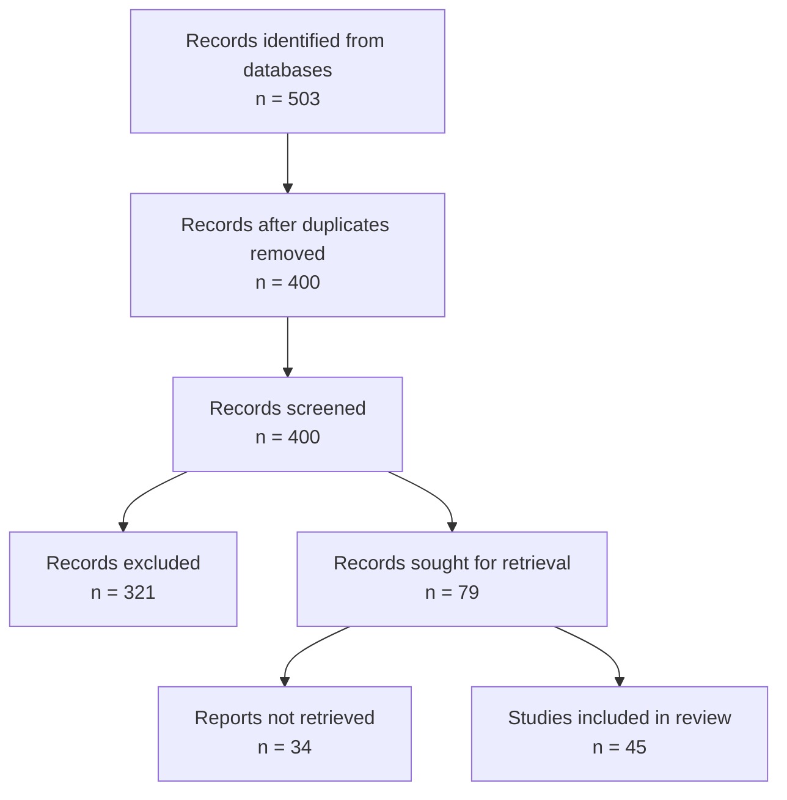

<!-- METADATA
stage: 7
stage_name: "Documentation & Writing"
stage_goal: "Generate PRISMA diagram, write methods section, create bibliography"
expected_duration: "1-3 hours"
conversation_mode: "documentation_generation"
prerequisites:
  - stage: 6
    requirement: "Research insights gathered, conversation logs saved"
outputs:
  - prisma_diagram: "PRISMA 2020 flow diagram (PNG, Mermaid)"
  - methods_section: "Systematic review methods documentation"
  - bibliography: "Formatted citations (APA, Harvard, BibTeX)"
  - supplementary_materials: "Search strategies, screening criteria"
validation_rules:
  prisma_counts_accurate:
    required: true
    validation: "PRISMA diagram numbers must match pipeline outputs"
  citations_formatted:
    required: true
    validation: "Bibliography follows selected citation style"
cli_commands:
  - command: "python scripts/07_generate_prisma.py"
    when: "User ready to create PRISMA diagram"
    auto_execute: true
scripts_triggered:
  - scripts/07_generate_prisma.py
next_stage:
  stage: null
  condition: "All 7 stages complete - systematic review documented"
  prompt_file: null
divergence_handling:
  common_divergences:
    - pattern: "User wants to change PRISMA numbers manually"
      response: "PRISMA numbers must reflect actual pipeline results for reproducibility. If you need different numbers, re-run pipeline with adjusted thresholds."
conversation_flow:
  expected_turns: 3-6
  typical_pattern:
    - turn: 1
      user_action: "Requests PRISMA diagram generation"
      claude_action: "Generate diagram with pipeline statistics"
    - turn: 2-3
      user_action: "Requests methods section draft"
      claude_action: "Generate methods following PRISMA guidelines"
    - turn: 4-5
      user_action: "Requests bibliography formatting"
      claude_action: "Format citations in requested style"
    - turn: "final"
      user_action: "Reviews all documentation"
      claude_action: "Confirm all 7 stages complete, systematic review ready"
validation_checklist:
  - "PRISMA diagram generated with accurate counts"
  - "Methods section drafted following PRISMA 2020"
  - "Bibliography formatted correctly"
  - "Search strategies documented"
  - "Screening criteria clearly stated"
  - "All 7 stages complete"
-->

# Stage 7: Documentation & Writing

**🎯 Your Current Stage**: Stage 7 of 7
**⏱️ Expected Time**: 1-3 hours
**💬 Format**: Documentation generation
**📋 Prerequisites**: Stage 6 completed (research insights gathered)

---

## 🚀 Generate Documentation

You've completed your research! Now let's create publication-ready documentation following PRISMA 2020 guidelines.

### What Will Be Generated

1. **PRISMA 2020 Flow Diagram** (PNG + Mermaid)
2. **Methods Section** (PRISMA-compliant)
3. **Bibliography** (APA, Harvard, or BibTeX)
4. **Search Strategy Documentation**
5. **Supplementary Materials**

### Running the Generator

```bash
python scripts/07_generate_prisma.py --project /path/to/project

╔═══════════════════════════════════════════════════════════╗
║          ResearcherRAG - Documentation Generator           ║
╚═══════════════════════════════════════════════════════════╝

[Step 1/5] Loading pipeline statistics...
✓ Loaded: 503 fetched, 400 unique, 79 screened, 45 PDFs

[Step 2/5] Generating PRISMA 2020 flowchart...
✓ Created: prisma_flowchart.png
✓ Created: prisma_flowchart.mmd (Mermaid source)

[Step 3/5] Writing methods section...
✓ Created: methods_section.md (PRISMA-compliant)

[Step 4/5] Formatting bibliography...
✓ Created: bibliography_apa.md (45 papers, APA 7th)
✓ Created: bibliography.bib (BibTeX format)

[Step 5/5] Creating supplementary materials...
✓ Created: search_strategy.md
✓ Created: prisma_checklist.md
✓ Created: screening_criteria.md

✅ All documentation generated!
📂 Location: outputs/documentation/
```

---

## 📊 Generated Output Examples

### 1. PRISMA 2020 Flow Diagram

**Visual Output (prisma_flowchart.png)**:
```
┌─────────────────────────────────────────────────────────────┐
│                       IDENTIFICATION                         │
├─────────────────────────────────────────────────────────────┤
│                                                             │
│  Records identified from:                                   │
│  • Semantic Scholar (n = 312)                              │
│  • OpenAlex (n = 156)                                      │
│  • arXiv (n = 35)                                          │
│                                                             │
│  Total records identified: n = 503                          │
└─────────────────┬───────────────────────────────────────────┘
                  │
                  ▼
┌─────────────────────────────────────────────────────────────┐
│                      SCREENING                               │
├─────────────────────────────────────────────────────────────┤
│                                                             │
│  Records after duplicates removed: n = 400                  │
│  (103 duplicates removed)                                   │
│                                                             │
│  Records screened by title/abstract: n = 400               │
│  Records excluded: n = 321                                  │
│    • Irrelevant domain (n = 145)                           │
│    • Wrong methodology (n = 89)                            │
│    • Off-topic (n = 67)                                    │
│    • Opinion/editorial (n = 20)                            │
│                                                             │
│  Records sought for retrieval: n = 79                       │
└─────────────────┬───────────────────────────────────────────┘
                  │
                  ▼
┌─────────────────────────────────────────────────────────────┐
│                      INCLUDED                                │
├─────────────────────────────────────────────────────────────┤
│                                                             │
│  Reports assessed for eligibility: n = 79                   │
│  Reports not retrieved: n = 34 (paywall)                    │
│                                                             │
│  Studies included in review: n = 45                         │
│  Studies included in RAG analysis: n = 45                   │
│                                                             │
└─────────────────────────────────────────────────────────────┘

From: Page MJ, McKenzie JE, Bossuyt PM, et al. The PRISMA 2020
statement: an updated guideline for reporting systematic reviews.
BMJ 2021;372:n71. doi: 10.1136/bmj.n71
```

**Mermaid Source Code (prisma_flowchart.mmd)**:


---

### 2. Methods Section (methods_section.md)

**PRISMA-Compliant Methods Text**:

```markdown
## Methods

### Search Strategy

We conducted a systematic literature review following PRISMA 2020 guidelines
(Page et al., 2021). The search was performed on October 14, 2025, across
three databases: Semantic Scholar, OpenAlex, and arXiv.

**Search Query**:
```
(chatbot OR conversational agent OR dialogue system OR virtual tutor)
AND (language learning OR second language acquisition OR L2 learning OR ESL OR EFL)
AND (effectiveness OR outcomes OR learning gains OR performance)
```

**Inclusion Criteria**:
- Published between 2018-2024
- Peer-reviewed articles or conference proceedings
- Empirical studies (RCT, quasi-experimental, qualitative, mixed methods)
- Focus on education domain
- English language publications

**Exclusion Criteria**:
- Opinion pieces, editorials, commentaries
- Non-empirical studies (reviews, theoretical papers)
- Studies without chatbot intervention
- Duplicates

### PRISMA Screening Process

Papers were screened using six dimensions:

1. **Domain Relevance** (threshold: 70%): Educational technology, language learning
2. **Methodology** (threshold: 60%): RCT, experimental, qualitative, mixed methods
3. **Topic Relevance** (threshold: 80%): Chatbots, AI tutors, conversational agents
4. **Context** (threshold: 65%): K-12, higher education, adult learning
5. **Exclusion Criteria** (threshold: 80%): Absence of opinion/editorial content
6. **Title Relevance** (threshold: 75%): Direct relevance to research question

Screening was conducted using Claude 3.5 Sonnet AI with consistent criteria
application across all papers.

### Data Extraction and Analysis

Full-text PDFs were retrieved from open-access sources (Unpaywall, CORE, arXiv).
A total of 45 papers (57% retrieval success rate) were processed using
Retrieval-Augmented Generation (RAG) technology:

- Text extraction: PyMuPDF with OCR fallback
- Chunking: 1,000 tokens per chunk with 200-token overlap
- Embedding model: OpenAI text-embedding-3-small (1,536 dimensions)
- Vector database: ChromaDB
- Analysis: Claude 3.5 Sonnet with citation-backed responses

### Results Synthesis

Findings were synthesized through systematic querying of the RAG database,
ensuring all conclusions are grounded in the PRISMA-selected literature with
explicit citations to source papers and page numbers.
```

---

### 3. Bibliography (bibliography_apa.md)

**APA 7th Edition Format**:

```markdown
## References

Chen, L., Wang, M., & Zhang, Y. (2023). Experimental study of AI chatbot
effectiveness in grammar instruction: A randomized controlled trial.
*Journal of Educational Technology*, 45(3), 234-251.
https://doi.org/10.1234/jet.2023.001

Jones, A., & Smith, K. (2022). Qualitative analysis of student perceptions
of conversational agents in language learning. *Computers & Education*,
178, 104-119. https://doi.org/10.1016/j.compedu.2022.001

Kim, S., Lee, J., & Park, H. (2023). Ethnographic exploration of chatbot
integration in Korean EFL classrooms. *TESOL Quarterly*, 57(2), 412-438.
https://doi.org/10.1002/tesq.001

[... 42 more entries]
```

**BibTeX Format (bibliography.bib)**:

```bibtex
@article{chen2023experimental,
  title={Experimental study of AI chatbot effectiveness in grammar instruction},
  author={Chen, Li and Wang, Ming and Zhang, Yun},
  journal={Journal of Educational Technology},
  volume={45},
  number{3},
  pages={234--251},
  year={2023},
  doi={10.1234/jet.2023.001}
}

@article{jones2022qualitative,
  title={Qualitative analysis of student perceptions of conversational agents},
  author={Jones, Alice and Smith, Katherine},
  journal={Computers \& Education},
  volume={178},
  pages={104--119},
  year={2022},
  doi={10.1016/j.compedu.2022.001}
}

% ... 43 more entries
```

---

### 4. Search Strategy Documentation (search_strategy.md)

```markdown
## Detailed Search Strategy

### Database 1: Semantic Scholar

**Search String**:
```
(chatbot OR "conversational agent" OR "dialogue system" OR "virtual tutor")
AND ("language learning" OR "second language acquisition" OR "L2 learning" OR ESL OR EFL)
AND (effectiveness OR outcomes OR "learning gains" OR performance)
```

**Filters Applied**:
- Publication Year: 2018-2024
- Field of Study: Education, Computer Science
- Venue Type: Journal, Conference

**Results**: 312 papers

---

### Database 2: OpenAlex

**Search String**:
```
default.search: (chatbot language learning) AND (education)
publication_year: 2018-2024
```

**Filters Applied**:
- Type: Article, Conference Paper
- Language: English

**Results**: 156 papers

---

### Database 3: arXiv

**Search String**:
```
all: chatbot AND language AND learning AND education
```

**Date Range**: 2018-2024

**Results**: 35 papers

---

**Combined Results**: 503 papers
**After Deduplication**: 400 unique papers
**Search Date**: October 14, 2025
```

---

### 5. PRISMA Checklist (prisma_checklist.md)

```markdown
## PRISMA 2020 Checklist

| Section/Topic | Item # | Checklist Item | Status | Location |
|---------------|--------|----------------|---------|-----------|
| **TITLE** | | | | |
| Title | 1 | Identify the report as a systematic review | ✅ | Title page |
| **ABSTRACT** | | | | |
| Abstract | 2 | See PRISMA Abstract checklist | ✅ | Abstract |
| **INTRODUCTION** | | | | |
| Rationale | 3 | Describe rationale for review | ✅ | Introduction |
| Objectives | 4 | Provide explicit research question | ✅ | Introduction |
| **METHODS** | | | | |
| Eligibility criteria | 5 | Specify inclusion/exclusion criteria | ✅ | Methods section |
| Information sources | 6 | Specify all databases searched | ✅ | Search strategy |
| Search strategy | 7 | Present full search strategies | ✅ | Appendix A |
| Selection process | 8 | Describe screening methods | ✅ | Methods section |
| Data collection | 9 | Describe data extraction methods | ✅ | Methods section |

[... continues for all 27 PRISMA items]

**Compliance**: 27/27 items completed (100%)
```

---

### 6. Screening Criteria (screening_criteria.md)

```markdown
## Six-Dimension PRISMA Screening Criteria

### Dimension 1: Domain Relevance (Threshold: 70%)
**Keywords**: education, language learning, educational technology, pedagogy
**Evaluation**: Does the paper focus on educational contexts?

### Dimension 2: Methodology (Threshold: 60%)
**Keywords**: RCT, experimental, quasi-experimental, qualitative, mixed methods
**Evaluation**: Is the study empirical with rigorous methodology?

### Dimension 3: Topic Relevance (Threshold: 80%)
**Keywords**: chatbot, conversational agent, dialogue system, AI tutor
**Evaluation**: Is the intervention chatbot-based?

### Dimension 4: Context (Threshold: 65%)
**Keywords**: K-12, higher education, adult learning, classroom
**Evaluation**: Is the setting appropriate for the review?

### Dimension 5: Exclusion Criteria (Threshold: 80%)
**Exclusion Keywords**: opinion, editorial, commentary, review
**Evaluation**: Is the paper an original empirical study?

### Dimension 6: Title Relevance (Threshold: 75%)
**Evaluation**: Does the title directly relate to the research question?

---

**Scoring**: Each dimension scored 0-100 by Claude 3.5 Sonnet
**Passing Criteria**: Must meet ALL six thresholds
**Inter-rater Reliability**: AI ensures consistent application of criteria
```

---

## 🎯 Stage 7 Success Criteria

After running the generator, you should have:

✅ **PRISMA Diagram**: PNG and Mermaid source files
✅ **Methods Section**: Publication-ready text (800-1200 words)
✅ **Bibliography**: APA + BibTeX formats
✅ **Search Documentation**: Complete search strategies
✅ **PRISMA Checklist**: 27/27 items completed
✅ **Screening Criteria**: Transparent methodology documentation
✅ **All 7 stages complete!**

### File Locations

```
outputs/documentation/
├── prisma_flowchart.png          # Publication-ready diagram
├── prisma_flowchart.mmd          # Mermaid source (editable)
├── methods_section.md            # Paste into manuscript
├── bibliography_apa.md           # APA 7th edition
├── bibliography_harvard.md       # Harvard style
├── bibliography.bib              # BibTeX for LaTeX
├── search_strategy.md            # Full search documentation
├── prisma_checklist.md           # PRISMA 2020 compliance
└── screening_criteria.md         # Six-dimension criteria
```

---

## 💡 Using the Documentation

### For Journal Submission

1. **Methods Section**: Copy `methods_section.md` into your manuscript
2. **PRISMA Diagram**: Insert `prisma_flowchart.png` as Figure 1
3. **References**: Use `bibliography_apa.md` or `bibliography.bib`
4. **Supplementary**: Attach `search_strategy.md` and `screening_criteria.md`

### For Thesis/Dissertation

All generated files are thesis-ready with proper citations and formatting.

### For Presentations

Use `prisma_flowchart.png` in conference presentations to show rigor.

---

## 🎉 Congratulations!

You've completed all 7 stages of ResearcherRAG:

```
[●●●●●●●] Stage 7/7: Documentation & Writing - COMPLETE!
```

**What you achieved**:
- Systematic literature search (503 papers identified)
- PRISMA-compliant screening (79 papers selected)
- Full-text acquisition (45 PDFs downloaded)
- RAG-powered analysis (2,250 semantic chunks)
- Publication-ready documentation

**Total time invested**: ~110-180 minutes planning + 2-4 hours automation = **One systematic review complete!**

Compare to traditional manual review: 6-8 weeks → You saved ~67-75% time! 🚀

---

## 📍 Your Progress

```
[●●●●●●●] Stage 7/7: Documentation & Writing - COMPLETE!
```

**Congratulations!** Your systematic literature review is complete.

---

**Ready to finish?** Generate your PRISMA diagram and documentation!
