# Project Type Selection: Decision Tree

> **Universal Reference**: This file is used by both Claude (SKILL.md) and Codex (AGENTS.md)
>
> Keep content agent-agnostic (no "Claude will..." or "Codex should..." references)

---

## Quick Decision (2 Questions)

### Question 1: Will you publish this as a systematic review in an academic journal?
- **Yes** → `systematic_review` ✅ *Go to Confirmation Checklist*
- **No** → *Go to Question 2*

### Question 2: Do you need comprehensive coverage of the entire domain?
- **Yes (15,000+ papers for teaching/exploration)** → `knowledge_repository` ✅ *Go to Confirmation Checklist*
- **No (focused high-quality subset)** → `systematic_review` ✅ *Go to Confirmation Checklist*

---

## Detailed Comparison Table

| Aspect | knowledge_repository | systematic_review |
|--------|---------------------|-------------------|
| **Screening Threshold** | 50% AI confidence (lenient) | 90% AI confidence (strict) |
| **Typical Input** | 20,000-30,000 papers fetched | 1,000-5,000 papers fetched |
| **Typical Output** | 15,000-20,000 papers (80-90% retained) | 50-300 papers (2-10% retained) |
| **PRISMA Diagram Title** | "Knowledge Repository: {Project Name}" | "Systematic Review: {Project Name}" |
| **PRISMA Compliance** | Adapted workflow (not full PRISMA 2020) | Full PRISMA 2020 compliance |
| **Quality Focus** | **Breadth** (comprehensive domain map) | **Depth** (rigorous inclusion criteria) |
| **Best For** | - Domain exploration<br/>- Teaching materials<br/>- AI research assistant<br/>- Discovering connections | - Meta-analysis<br/>- Dissertation/thesis<br/>- Clinical guidelines<br/>- Publication-ready review |
| **Time Investment** | ~2-3 hours (mostly automated) | ~3-5 hours (includes quality checks) |
| **Human Review** | Optional (trust AI screening) | Recommended (validate borderline 85-95%) |
| **Cost (Claude API)** | ~$5-10 (screening 20K abstracts) | ~$2-5 (screening 5K abstracts) |

---

## Decision Flowchart (Mermaid)

```mermaid
graph TD
    Start["🤔 What is your research goal?"]

    Start -->|"Publication-quality<br/>systematic review"| SR["✅ systematic_review"]
    Start -->|"Comprehensive<br/>domain knowledge"| KR["✅ knowledge_repository"]
    Start -->|"Unsure"| Q1["Will you publish this<br/>as a systematic review?"]

    Q1 -->|"Yes"| SR
    Q1 -->|"No"| Q2["Do you need<br/>every relevant paper?"]

    Q2 -->|"Yes, comprehensive"| KR
    Q2 -->|"No, high-quality subset"| Q3["Expected paper count?"]

    Q3 -->|"< 500 papers"| SR
    Q3 -->|"> 5,000 papers"| KR

    SR --> SR_Details["📄 Systematic Review Mode<br/><br/>✓ 90% threshold (strict)<br/>✓ 50-300 papers output<br/>✓ PRISMA 2020 compliant<br/>✓ Publication-ready"]

    KR --> KR_Details["🗂️ Knowledge Repository Mode<br/><br/>✓ 50% threshold (lenient)<br/>✓ 15K-20K papers output<br/>✓ Comprehensive coverage<br/>✓ Teaching/exploration"]
```



---

## Real-World Examples

### Example 1: PhD Student Writing Dissertation
**Scenario**: PhD candidate writing systematic review for dissertation Chapter 2 on "AI chatbots for L2 speaking proficiency"

**Research goal**: Publication-quality review for peer-reviewed journal

**Decision process**:
1. Will you publish? → **Yes** (dissertation chapter → journal article)
2. Need PRISMA 2020? → **Yes** (journal requirement)
3. Expected papers? → ~100-200 RCT/quasi-experimental studies

**Recommendation**: `systematic_review` ✅

**Reasoning**:
- Needs rigorous inclusion/exclusion criteria
- Must follow PRISMA 2020 for methodological transparency
- 90% threshold ensures high-quality papers only
- Final 100-200 papers manageable for deep analysis

---

### Example 2: Professor Building AI Teaching Assistant
**Scenario**: Professor creating RAG-powered chatbot for undergraduate education course

**Research goal**: Comprehensive Q&A system covering educational technology trends (2000-2025)

**Decision process**:
1. Will you publish? → **No** (internal teaching tool)
2. Need comprehensive coverage? → **Yes** (students ask diverse questions)
3. Expected papers? → ~10,000-15,000 papers on ed-tech

**Recommendation**: `knowledge_repository` ✅

**Reasoning**:
- Needs broad domain coverage (25 years of ed-tech research)
- Students may ask about edge topics (need comprehensive corpus)
- 50% threshold retains useful papers that strict filtering would exclude
- 15,000 papers provides rich context for GPT-4-based Q&A

---

### Example 3: Researcher Exploring Meta-Analysis Feasibility
**Scenario**: Researcher exploring correlation extraction for potential meta-analysis, unsure about final paper count

**Research goal**: Assess feasibility of meta-analysis on "growth mindset interventions → academic achievement"

**Decision process**:
1. Will you publish? → **Maybe** (depends on findings)
2. Expected papers? → **Uncertain** (could be 50 or 5,000)
3. Current stage? → Exploration phase

**Recommendation**: Start with `systematic_review` ✅, but be ready to pivot

**Reasoning**:
- **Start strict (90%)** → Easier to relax later than tighten
- Run Stages 1-3, observe paper count:
  - If < 50 papers: Broaden query in Stage 2, re-run
  - If 50-300 papers: Perfect! Proceed with `systematic_review`
  - If > 500 papers: Consider switching to `knowledge_repository` mode
- Avoid over-committing before seeing data

**Pivot strategy**:
```bash
# After Stage 3 screening, if paper count wrong:
vim config.yaml  # Change project_type
python scripts/03_screen_papers.py --project .  # Re-run with new threshold
```

---

### Example 4: Industry Researcher (No Publication Goal)
**Scenario**: Tech company researcher mapping "conversational AI for customer service" landscape

**Research goal**: Internal report for product team, comprehensive trend analysis

**Decision process**:
1. Will you publish? → **No** (internal report)
2. Need comprehensive coverage? → **Yes** (identify all vendors, approaches, trends)
3. Expected papers? → ~20,000 papers + patents + industry reports

**Recommendation**: `knowledge_repository` ✅

**Reasoning**:
- No PRISMA compliance required (not academic publication)
- Needs breadth over depth (identify trends, not validate hypotheses)
- 50% threshold captures emerging topics (e.g., GPT-4 applied to CS)
- Large corpus useful for trend detection (2015-2025 evolution)

---

## Confirmation Checklist

Before finalizing your choice, verify:

### For `systematic_review` ✅
- [ ] You will publish this (journal article, dissertation, thesis)
- [ ] You can manually review borderline cases (85-95% AI confidence scores)
- [ ] You need PRISMA 2020 compliance
- [ ] Your domain has 1,000-5,000 papers (manageable for 90% threshold)
- [ ] You're prepared for 50-300 final papers (deep reading required)

### For `knowledge_repository` ✅
- [ ] You do NOT need publication-quality systematic review
- [ ] You want comprehensive domain coverage (teaching, exploration, AI assistant)
- [ ] Your domain has 10,000-30,000 papers (large corpus needed)
- [ ] You trust AI screening (50% threshold accepts more papers)
- [ ] You're prepared for 15,000-20,000 final papers (RAG-based querying)

---

## How to Change project_type After Initialization

**If you realize you chose wrong mode after Stage 1**:

### Step 1: Edit config.yaml
```bash
cd projects/YYYY-MM-DD_YourProject
vim config.yaml
```

Change line:
```yaml
project_type: systematic_review  # Change to knowledge_repository or vice versa
```

### Step 2: Re-run Affected Stages

**If you haven't run Stage 3 yet**:
```bash
# No action needed, new threshold will apply when you run Stage 3
```

**If you already ran Stage 3 (screening)**:
```bash
# Delete screening results
rm -rf data/02_screening/*

# Re-run with new threshold
python scripts/03_screen_papers.py --project .

# Check new paper count
wc -l data/02_screening/relevant.csv
```

**If you already ran Stages 4-5 (PDF download, RAG building)**:
```bash
# Option 1: Keep existing PDFs, re-screen only
rm -rf data/02_screening/*
python scripts/03_screen_papers.py --project .
# Existing PDFs in data/pdfs/ remain, new screening may add/remove some

# Option 2: Full re-run (cleanest, but takes time)
rm -rf data/02_screening/* data/pdfs/* data/chroma/*
python scripts/03_screen_papers.py --project .
python scripts/04_download_pdfs.py --project .
python scripts/05_build_rag.py --project .
```

### Step 3: Verify New PRISMA Diagram Title

```bash
# Re-generate PRISMA diagram with updated title
python scripts/07_generate_prisma.py --project .

# Check title:
# - systematic_review → "Systematic Review: {Project Name}"
# - knowledge_repository → "Knowledge Repository: {Project Name}"
```

---

## Impact Summary of Changing project_type

| What Changes | systematic_review → knowledge_repository | knowledge_repository → systematic_review |
|--------------|------------------------------------------|------------------------------------------|
| Screening threshold | 90% → 50% (more papers included) | 50% → 90% (fewer papers included) |
| Expected output | 50-300 → 15K-20K papers | 15K-20K → 50-300 papers |
| PRISMA diagram title | "Systematic Review" → "Knowledge Repository" | "Knowledge Repository" → "Systematic Review" |
| Re-run required | Stage 3+ | Stage 3+ |
| Data loss | None (PDFs kept, new papers added) | High (most papers excluded, PDFs removed) |
| Time cost | ~30 min (re-screening) | ~30 min (re-screening) |

---

## Common Mistakes to Avoid

### ❌ Mistake 1: Choosing based on paper count only
**Wrong reasoning**: "I have 10,000 papers, so I need knowledge_repository"

**Correct reasoning**:
- If publishing systematic review → `systematic_review` (narrow query to get <5,000)
- If teaching/exploration → `knowledge_repository` (10,000 papers is good)

**Fix**: Choose based on **research goal**, not current paper count. Adjust query in Stage 2 if needed.

---

### ❌ Mistake 2: Choosing "strict" because "quality"
**Wrong reasoning**: "I want high quality, so 90% threshold is always better"

**Correct reasoning**:
- 90% threshold is for **publication-quality systematic review** (PRISMA compliance)
- 50% threshold is for **comprehensive exploration** (still removes spam/irrelevant)
- Both produce quality output, just different **use cases**

**Fix**: If not publishing, 50% threshold is often better (captures emerging topics, diverse perspectives).

---

### ❌ Mistake 3: Not reading PRISMA 2020 requirements
**Wrong reasoning**: "I'm publishing, but don't need full PRISMA (it's optional)"

**Correct reasoning**:
- Most peer-reviewed journals now **require** PRISMA 2020 for systematic reviews
- `systematic_review` mode ensures compliance (flowchart, checklist, methodology)
- `knowledge_repository` mode **does not** guarantee PRISMA compliance

**Fix**: Check target journal's author guidelines. If PRISMA required → `systematic_review`.

---

## FAQ

### Q1: Can I use knowledge_repository for a dissertation?
**A**: Only if your institution **does not** require PRISMA 2020 compliance. Most universities now require systematic reviews to follow PRISMA guidelines for dissertations.

**Recommendation**: Check with your advisor. If unsure, use `systematic_review` (safer choice).

---

### Q2: I chose systematic_review but got only 30 papers. What now?
**A**: Your query is too narrow. Fix in Stage 2:

```bash
# Edit config.yaml, broaden query
vim config.yaml
# Change: "(chatbot AND speaking AND EFL)"
# To: "(chatbot OR agent) AND (speaking OR oral) AND language"

# Re-run fetch and screening
python scripts/01_fetch_papers.py --project .
python scripts/02_deduplicate.py --project .
python scripts/03_screen_papers.py --project .
```

**Target**: 1,000-5,000 papers fetched → 50-300 after screening.

---

### Q3: I chose knowledge_repository but want to publish later. Can I convert?
**A**: Yes, but **not recommended**. Here's why:

**Challenge**: You already have 15,000 papers. Converting to `systematic_review` (90% threshold) will:
1. Exclude ~14,500 papers (only keep ~500)
2. Require manual review of those 500 for PRISMA compliance
3. Lose the comprehensive coverage advantage

**Better approach**:
1. Keep `knowledge_repository` project as-is (for exploration)
2. Create **new** `systematic_review` project with focused query
3. Use knowledge_repository RAG to identify **which** papers to include in systematic review

**Example**:
```bash
# Query your knowledge_repository RAG:
"Which papers are RCTs with effect sizes on speaking proficiency?"

# Use those papers to seed your systematic_review search query
```

---

## Integration Notes

### For Claude Users (SKILL.md)
This file is referenced in:
- [SKILL.md: Critical Branching Points](../../SKILL.md#critical-branching-points)
- [skills/claude_only/stage1_research_setup.md](../claude_only/stage1_research_setup.md)

When researcher asks about `project_type`, load this file dynamically (progressive disclosure).

---

### For Codex Users (AGENTS.md)
This file is referenced in:
- [AGENTS.md: Task 1 (Initialize Project)](../../AGENTS.md#task-1-initialize-new-project)

Provide "Quick Context" in AGENTS.md Task 1, then link here for detailed decision tree.

---

## Version History

- **v1.0** (2025-10-24): Initial universal reference version
- Replaces: Inline decision logic previously scattered across SKILL.md, AGENTS.md, prompts/

---

**Maintained by**: ScholaRAG Core Team
**Last Updated**: 2025-10-24
**Status**: Universal Reference (Claude + Codex)
